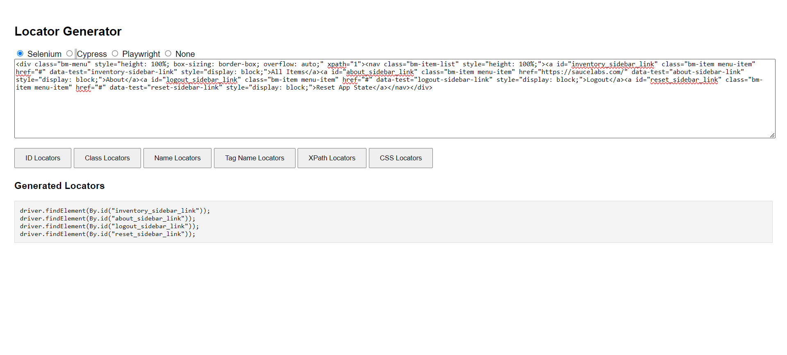
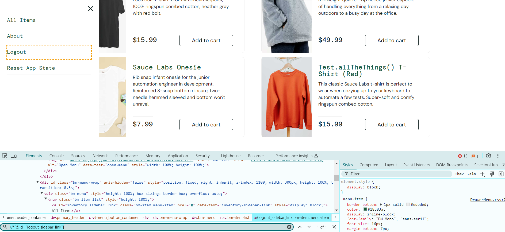

# Locator Generator

The Locator Generator is a simple tool for generating locator code snippets for automation frameworks (Selenium, Cypress, Playwright) based on an HTML DOM input.

## Features

- **Framework Selection**: Generate locators for Selenium, Cypress, Playwright, or none.
- **Locator Strategies**: Supports ID, Class, Name, Tag Name, XPath, and CSS locators.
- **Interactive UI**: Input HTML DOM and generate locators with ease.

## How to Use

1. **Open the HTML File**: Open `index.html` in your web browser.
2. **Select Framework**: Choose your automation framework.
3. **Paste DOM**: Input your HTML DOM content.
4. **Generate Locators**: Click the desired button to generate locators.
5. **View Output**: See the generated locators in the output area.

## Supported Frameworks

- **Selenium**: `driver.findElement(By...)`
- **Cypress**: `cy.get(...)` (XPath requires `cypress-xpath` plugin)
- **Playwright**: `await page.locator(...)`

## Contributing

Contributions are welcome! Fork the repository, make your changes, and submit a pull request.

## ScreenShots

